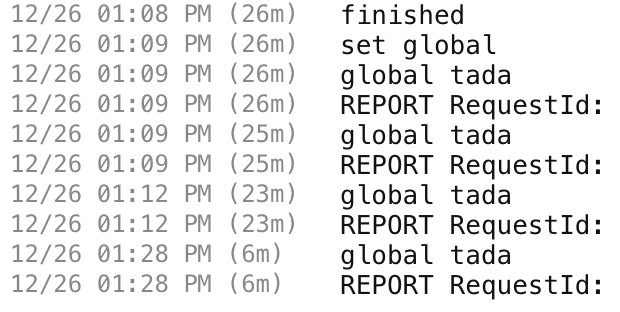

Now v2: Global State
===

This is a quick proof of concept that I wanted to put together.

My biggest obstacle to fully embracing Now v2 was being able to reuse database connections across lambdas and invocations.

I found two examples of this, one from [@rauchg](https://spectrum.chat/zeit/now/now-2-0-connect-to-database-on-every-function-invocation~e25b9e64-6271-4e15-822a-ddde047fa43d?m=MTU0NDkxNzkwMzE3Mw==) and one from [@cayasso](https://spectrum.chat/zeit/now/thoughts-on-why-now-2-0-is-kinda-disappointing~cbad7540-8159-41a7-9767-9c3f6310b497?m=MTU0NTUyNjU5OTUxNA==). But they still didn't make a whole lot of sense.

The zeit docs on [In-memory Cahcing and Global State](https://zeit.co/docs/v2/deployments/concepts/lambdas/#in-memory-caches) weren't particularly helpful either.

So I set out to figure it out for myself.

This repo consists of two functions

## global/index.js
Exports a function. Code looks like this:
```
let global;

module.exports = () => {
  if (!global) {
    console.log('set global');
    global = 'tada';
  }
  return global;
};
```
The `global` variable is set in the global scope. The functions just checks to see if it is already set. If not it will set it and export it. It will also log `set global` to the console only if the function is called and `global` is falsey

## index.js
Exports a micro endpoint. Code looks like this:
```
const { text } = require('micro');
const global = require('./global');

module.exports = (req, res) => {
  console.log('global', global());
  res.end('tada');
};
```
This simple endpoint calls the function we exported from `global` and sends a dummy response.

This is what the logs look like when deployed on Now.

Notice that over the course of 20 min `set global` is only called once. But the value of `global` is logged correctly every time.
